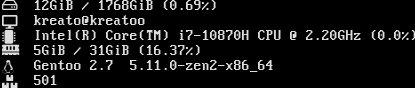

# pyfetch

Stylish and simple fetch for your terminal.

# Dependencies
* fontawesome on your system
* distro package on PyPi (only for linux systems)
* psutil package on PyPi
* colorama package on PyPi

# Installation
* Clone the repo
* Type `pip install distro colorama psutil` to install the dependencies (for windows its only `pip install colorama distro`) (but for gentoo its `pip install distro colorama psutil --user`)
* Type `make install` as root
* Enjoy!

# Credits
* Yellowsink for showing me that argparser is garbage & replacing argparser with doing it manually
